# Kim Perez - Portfolio
[Portfolio](https://kxp-portfolio.netlify.app/index.html/) "Link to Portfolio"
[GitHub](https://www.github.com/The-Programming-Mango/Portfolio-Assignment/) "Link to my GitHub Repository"
[Presentation](https://youtu.be/fJDSAyBvPdU/) "Link to my presentation slide deck"

## Purpose
Demonstation of a mock digital portfolio.

## Functionality / Features
-Navigation Bar
-Links to external websites
-Link to my resume PDF file

## Sitemap
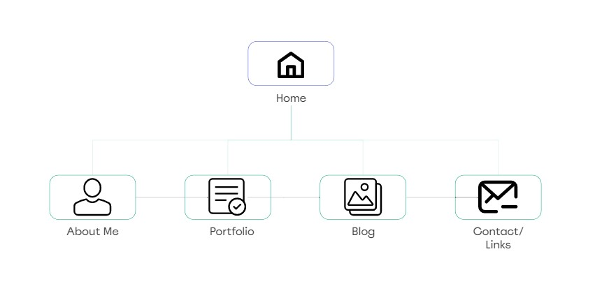
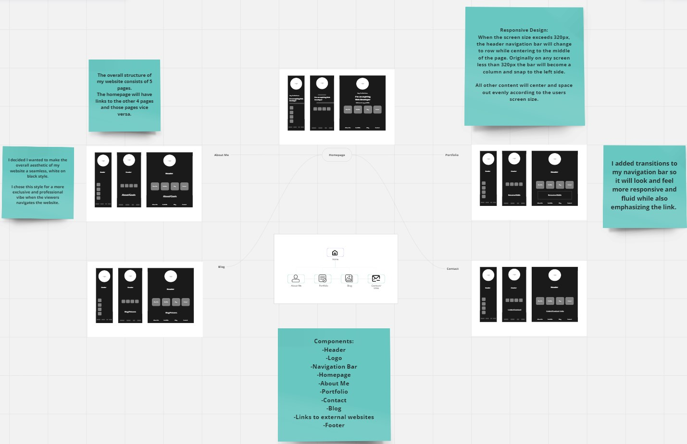

## Screenshots
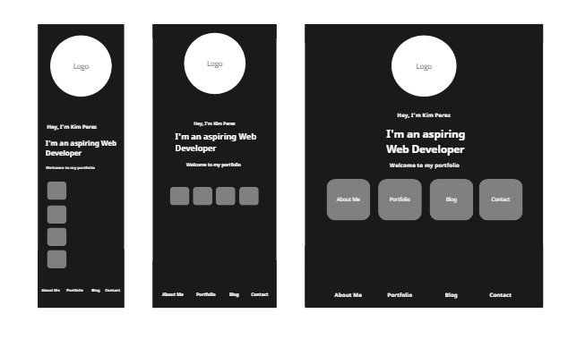
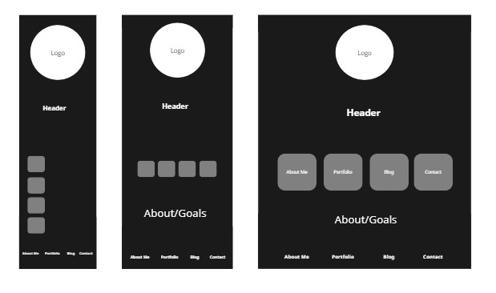
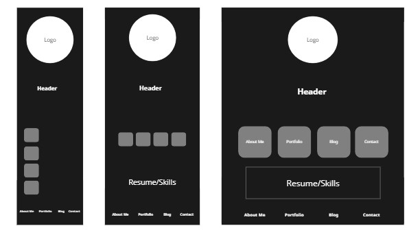

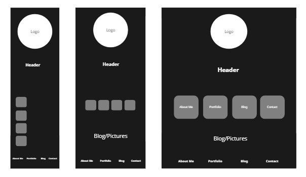
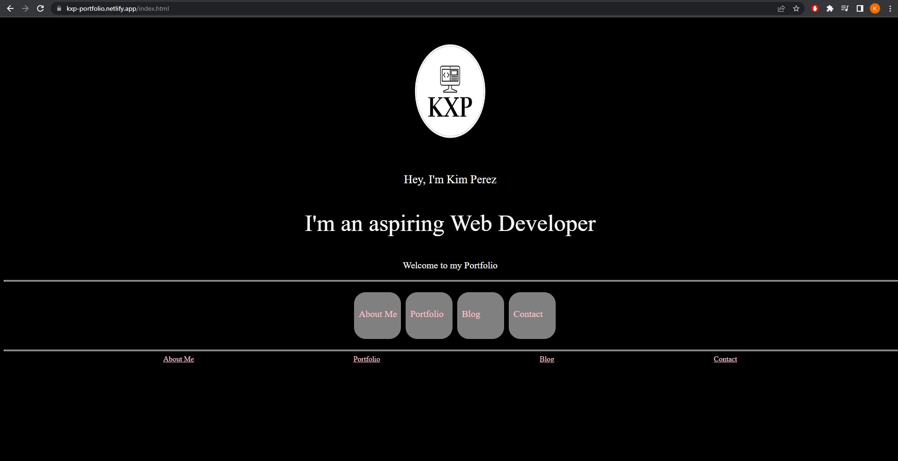
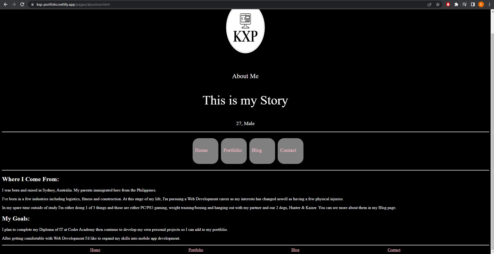
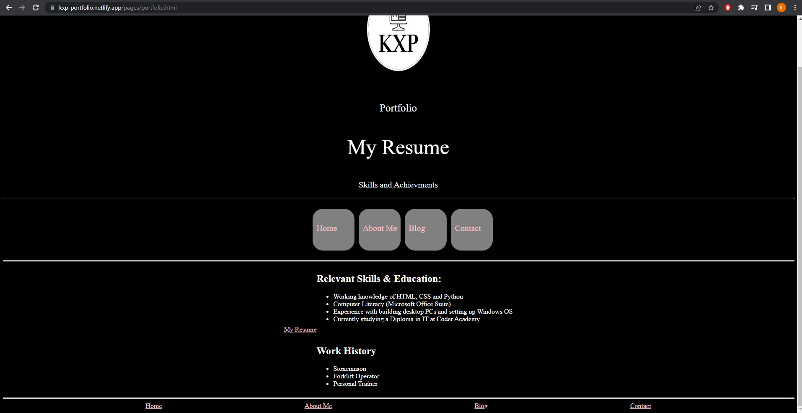
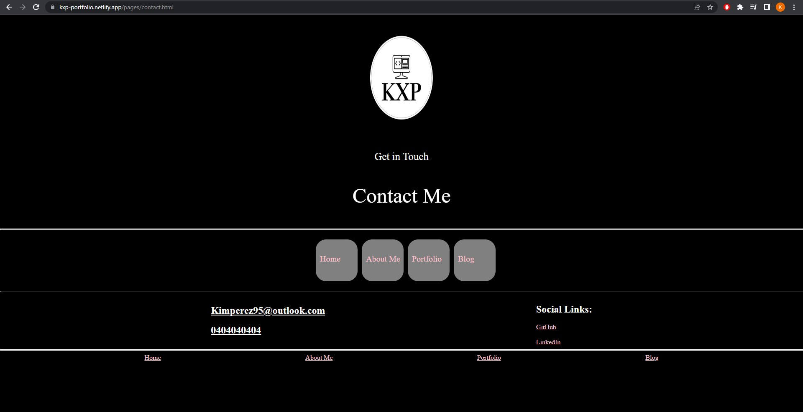
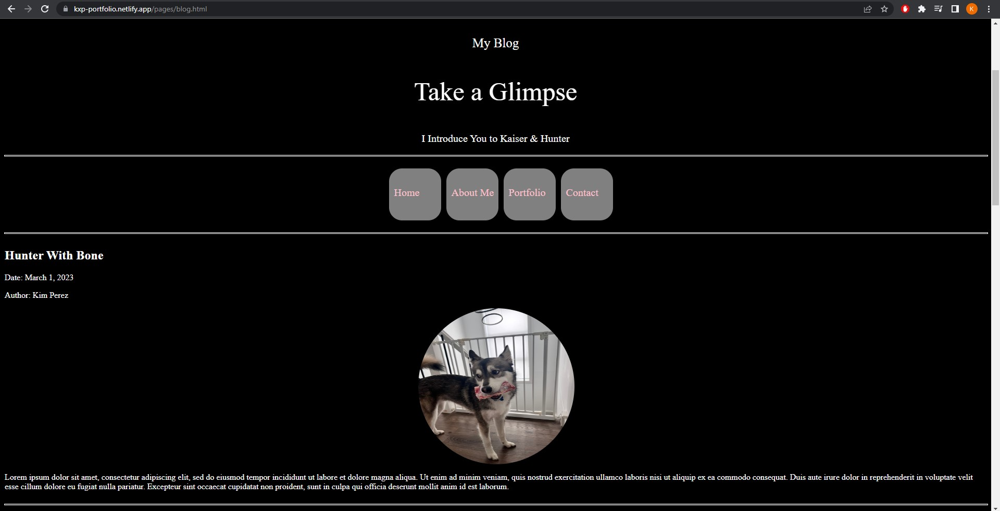

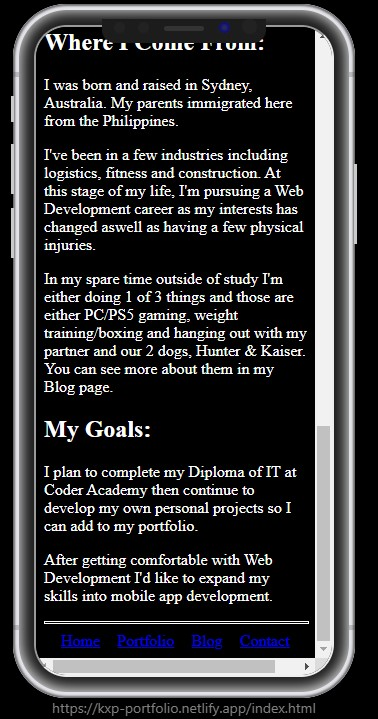
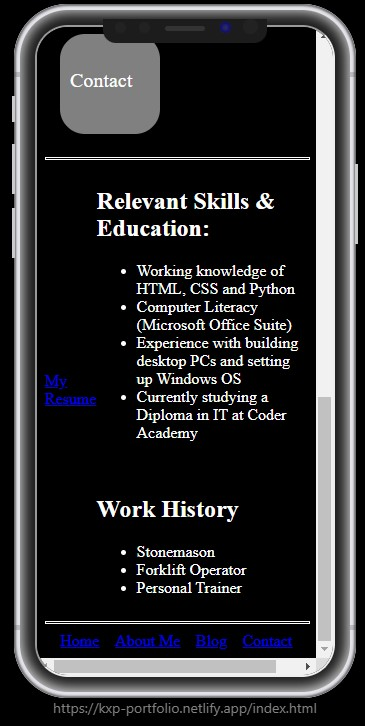
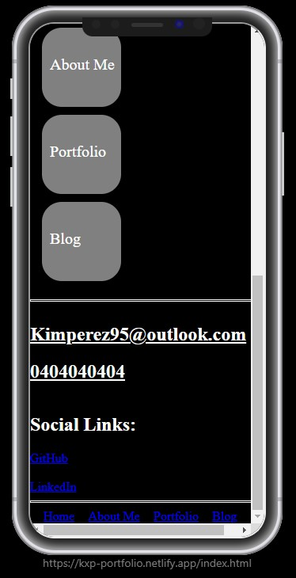
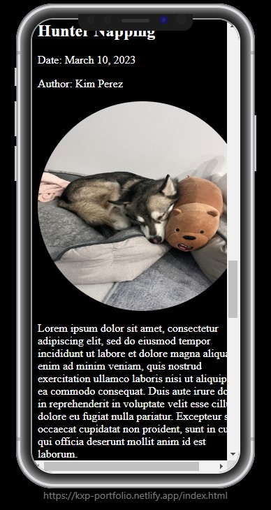

## Target Audience
Recruiters & Employers

## Tech Stack
Software and Components used are:
- HTML
- CSS
- SASS
- Markdown
- Miro
- VSC
- Netlify
- GitHub Repository